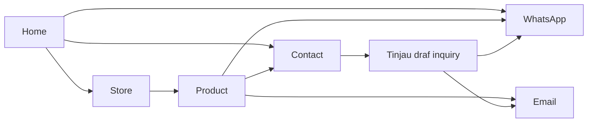

# Peta revisi website BOSS BAHAN PVC - Rev 1

Tanggal audit: 9 September 2026. Baseline kode: `74df90c`.

Status tahap awal: **pemetaan lengkap sebelum implementasi**, termasuk tiga jawaban pemilik pada 9 September 2026. Dokumen feedback sudah dibaca penuh, teksnya diekstrak, dan seluruh 15 halaman diperiksa secara visual. Website, aset produksi, container, dan repository remote belum diubah selama tahap pemetaan.

Sumber utama: `rev1/Web Feedback.pdf`, 15 halaman. Nomor halaman di bawah mengacu pada urutan halaman PDF, termasuk halaman judul. Sumber pembanding: kode website saat ini, `lib/catalog.json`, data impor workbook yang sudah ada, dan inventaris `ASSETS/`.

## 1. Arah revisi

Website diarahkan menjadi katalog konsultasi yang lebih lugas: pengunjung menemukan bahan, memilih spesifikasi yang memang dapat ditanyakan, lalu meminta harga dan stok lewat WhatsApp atau email. Home membangun pengenalan dan kepercayaan; Store menjadi tujuan pencarian; setiap produk mempunyai URL sendiri; Contact menampung kebutuhan pelanggan.

**Keputusan pemilik yang mengatasi ambiguitas PDF:** website adalah portfolio material yang dapat diadakan. WMS berada di luar website; tidak ada jumlah inventory, sinkronisasi WMS, atau transaksi ecommerce. Belum ada data stok/foto-warna baru. Varian warna yang diperlukan dibuat dari foto bahan yang sudah ada menggunakan alat gambar GPT, tanpa label ilustrasi pada tampilan pelanggan sesuai koreksi lanjutan pemilik. Label produk dikelola melalui file data/import; tidak ada halaman admin.

Identitas tetap **BOSS BAHAN PVC**. Sapaan **Bos** ditujukan kepada pelanggan. Warna hitam dan emas, logo round, favicon, banner merek terpisah, serta seal dengan BOSS APPROVED di atas dan lima bintang di bawah tetap digunakan.

Prioritas:

- **P0 - Fondasi:** pemisahan halaman, navigasi, penerusan pilihan inquiry, aturan label, struktur stok/satuan/foto warna.
- **P1 - Revisi utama:** hero, copy seluruh bagian yang dikomentari, form, WhatsApp, dan tampilan mobile.
- **P2 - Penyelesaian:** konsistensi ID/EN, metadata per halaman, tautan lama, pengujian, dokumentasi, Graphify, dan build review.

Status pada matriks:

- **Siap dipetakan:** maksud feedback cukup jelas untuk dirancang dan diterapkan setelah tahap pemetaan selesai.
- **Keputusan teknis:** pilihan pelaksanaan yang diusulkan; bukan tambahan permintaan dari PDF.
- **Perlu data/jawaban:** maksud bisnis atau data sumber belum cukup untuk menentukan hasil akhir.

## 2. Matriks cakupan seluruh PDF

| ID | Hal. | Feedback dan sasaran | Rencana revisi / kriteria selesai | Prioritas dan status |
| --- | --- | --- | --- | --- |
| H01 | 2 | Foto gudang terlalu gelap di mobile | Sesuaikan opacity foto, gradient, crop, dan posisi pada breakpoint mobile. Gudang tetap terlihat, teks tetap terbaca; periksa 320, 390, 768, dan 1440 px. Gunakan foto asli. | P1 - Siap dipetakan |
| H02 | 2-3 | Headline Slide 1, 2, dan 3 | Petakan sebagai tiga slide hero karena PDF menamainya demikian. Susun tinggi konten yang stabil, navigasi slide, pause, dan reduced motion. Slide 1 dan 3 tetap tercatat terpisah walaupun pesannya mirip. | P1 - Keputusan teknis |
| H03 | 2 | Slide 1: pencarian bahan harga pabrik dan kebutuhan usaha | Headline, paragraf produksi/jualan/proyek, daftar kulit sintetis/mika/rigid/spunbond/terpal, eceran-grosir, serta dua manfaat dimasukkan ke draft copy. Perbaiki tanda baca dan ejaan. | P1 - Siap dipetakan |
| H04 | 2 | Slide 1: Jelajahi Produk / Konsultasi Langsung | CTA produk menuju Store; CTA konsultasi menuju WhatsApp dengan pesan pembuka. Nomor mengikuti konfigurasi bersama. | P1 - Siap dipetakan |
| H05 | 2-3 | “Langsung Bayar” / “Tinggal order” | Ada konflik dengan arahan langsung pemilik bahwa website untuk inquiry. Usulkan copy “Cari bahan. Cek harga. Ajukan penawaran.” atau “Lanjutkan pemesanan bersama tim kami.” Tidak membentuk alur checkout. | P1 - Rekonsiliasi arahan |
| H06 | 3 | Slide 2: Barang Lengkap, Stok Banyak, Harga Pabrik; “Boss standby 24” | Gunakan pesan kelengkapan dan pengadaan, bukan total inventory. Ajakan mengirim kebutuhan kapan saja tidak menjanjikan staf membalas 24 jam. | P1 - Keputusan pemilik/editorial |
| H07 | 3 | Slide 3: “Cari bahan harga pabrik? Bos, kami siapin bahannya.” | Susun headline, paragraf kebutuhan usaha, daftar material, eceran-grosir, dua manfaat, dan CTA Jelajahi Produk / Tanya Harga & Kebutuhan. | P1 - Siap dipetakan |
| H08 | 4 | Tentang merek: SIAPA BOSS BAHAN PVC? | Ganti eyebrow/judul/deskripsi sesuai narasi satu pemasok untuk berbagai kebutuhan, bantuan memilih bahan, penawaran, dan kepercayaan pelanggan. Pertahankan banner merek yang terpisah dari logo header. | P1 - Siap dipetakan |
| H09 | 4 | Tagline “Cari bahan?, Kami siapkan.” | Normalisasi menjadi “Cari bahan? Kami siapkan.” dan terjemahan Inggris yang sepadan. | P1 - Siap dipetakan |
| H10 | 4 | Langkah 01 Sebutkan Kebutuhan dan alternatif merah | Gunakan versi merah sebagai ringkasan kerja: “Sampaikan kebutuhan Anda” dengan jenis bahan, jumlah, lokasi kirim, dan bantuan memilih bahan. Simpan maksud pendampingan dari versi panjang. | P1 - Keputusan editorial |
| H11 | 5 | Langkah 02 Pilih Bahan dan Cek Harga | Ubah judul dan uraian untuk bantuan mencari produk sesuai kebutuhan. | P1 - Siap dipetakan |
| H12 | 5 | Langkah 03 Dapatkan Penawaran / harga spesial | Ubah uraian ke penawaran berdasarkan kebutuhan dan jumlah pembelian; jangan mengubahnya menjadi diskon angka yang tidak ada sumbernya. | P1 - Siap dipetakan |
| H13 | 5 | Tambah harga pabrik, stok selalu ready, kirim seluruh Indonesia | Tampilkan harga pabrik, kesiapan pengadaan, dan pengiriman seluruh Indonesia. Ketersediaan aktual dikonfirmasi melalui inquiry sesuai portfolio tanpa WMS. | P1 - Keputusan pemilik |
| H14 | 5 | Hapus “Mitra bisnis Anda” dan “Pengadaan sesuai kebutuhan” | Hapus kedua butir dari manfaat hero. Ini bukan instruksi menghapus seluruh konsep pengadaan dari bagian lain. | P1 - Siap dipetakan |
| H15 | 5 | Kartu Pilihan Spesifikasi menjadi Harga Pabrik | Ganti judul, subteks, dan ikon yang relevan pada trust strip. | P1 - Siap dipetakan |
| H16 | 6 | Kapabilitas: “Bahan Siap. Harga Bersaing. Usaha Makin Lancar.” | Ganti heading dan paragraf sesuai pesan pilihan lengkap, harga pabrik, dan pemenuhan kebutuhan usaha. Foto/video fasilitas asli tetap menjadi bukti visual. | P1 - Siap dipetakan |
| H17 | 6 | Penyimpanan material / stok siap jalan | Revisi subjudul dan uraian tentang material dalam roll. Klaim stok mengikuti kebijakan ketersediaan yang ditetapkan. | P1 - Siap dipetakan, terkait H13 |
| H18 | 6 | Pilihan spesifikasi produk menjadi Harga Pabrik | Ganti manfaat kapabilitas dengan harga kompetitif dan penawaran berdasarkan kebutuhan. Hindari menjanjikan margin pelanggan sebagai hasil pasti. | P1 - Siap dipetakan |
| H19 | 7 | Koordinasi pengadaan dan pengiriman | Ubah uraian: persiapan jumlah barang dan koordinasi pengiriman. | P1 - Siap dipetakan |
| H20 | 7 | CTA “Tanya Stok & Harga Pabrik” | Arahkan ke kontak/inquiry dengan konteks kebutuhan bahan. CTA tidak membuka proses pembelian online. | P1 - Siap dipetakan |
| H21 | 7 | Pengadaan Fleksibel menjadi MOQ fleksibel / lebih banyak lebih murah | Ganti kartu manfaat menjadi “MOQ Fleksibel”; subteks menyampaikan penawaran sesuai volume. Angka MOQ dan tingkatan harga hanya berasal dari data bisnis. | P1 - Siap dipetakan |
| H22 | 7-8 | Bagian yang disebut Footer: “Butuh bahan apa, Bos?” | Screenshot merujuk kolom ajakan konsultasi di bagian quote, bukan copyright footer. Gunakan heading, ringkasan bahan/ukuran/ketebalan/jumlah, tiga manfaat, dan ajakan WhatsApp yang baru. | P1 - Siap dipetakan |
| S01 | 10 | Home, Store, dan Product dipisah untuk kebutuhan iklan | Buat route mandiri; landing langsung ke Store atau produk tidak memerlukan scroll Home. Header/footer dan identitas tetap konsisten. | P0 - Siap dipetakan |
| S02 | 10 | Klik produk membuka product page sendiri atau tab baru | Gunakan URL produk permanen dan link asli. Default tab yang sama; pengunjung tetap dapat membuka tab baru dengan kontrol browser. Modal bukan tujuan utama lagi. | P0 - Keputusan teknis |
| S03 | 10 | Deskripsi singkat dengan See More | Ringkasan selalu terlihat; detail panjang menggunakan kontrol “Lihat selengkapnya” / “See more” yang dapat dibuka dengan keyboard. Deskripsi pendek tidak diberi tombol yang tidak perlu. | P1 - Siap dipetakan |
| S04 | 11 | Variasi ukuran mengikuti stok | Ukuran pilihan mengikuti spesifikasi material yang dapat diadakan dalam katalog. Tidak menonaktifkan varian berdasarkan perkiraan stok dan tidak membuat inventory. Konfirmasi aktual melalui tim. | P0 - Keputusan pemilik |
| S05 | 11 | Screenshot pilihan Roll/Meter/Lembar | Batasi satuan per produk berdasarkan data impor dan override. Roll/Meter untuk bahan otomotif yang sumbernya menyebut keduanya; satuan lembar untuk terpal jadi. Satuan lain dibahas lewat inquiry. | P0 - Keputusan teknis berbasis data tersedia |
| S06 | 11 | Pilih warna, foto mengikuti | Audit foto asli; generate varian yang belum tersedia dari foto bahan terkait menggunakan alat gambar GPT. Tetapkan mapping warna ke aset; tidak menampilkan label ilustrasi sesuai arahan lanjutan pemilik. | P0 - Diizinkan pemilik; pemetaan dan produksi aset saat implementasi |
| S07 | 12 | MP TECH hanya otomotif, mika/rigid, dan Terpal PVC Premium CP | Terapkan whitelist produk eksplisit pada kartu dan halaman produk, termasuk baris kode/deskripsi yang saat ini menambahkan MP TECH secara tetap. Audit khusus Nafa Bahan Sampul yang saat ini masuk kategori `sheet`. | P0 - Siap dipetakan |
| S08 | 12 | Label dapat diisi sendiri | Tambahkan label opsional dalam file override produk; label kosong tidak merender badge. Impor ulang mempertahankan override tim. Tanpa halaman admin. | P0 - Keputusan pemilik |
| C01 | 13-14 | Contact Page / MINTA HARGA & CEK STOK | Buat Contact mandiri dan ubah heading/intro form sesuai feedback. Home cukup memuat ajakan yang menuju kontak. | P0/P1 - Siap dipetakan |
| C02 | 14 | Bahan yang dicari / Pilih bahan yang mau ditanyakan | Ubah label dan placeholder selector; pilihan produk dari Product tetap terbawa ke form. | P1 - Siap dipetakan |
| C03 | 14 | Nama Bos / Nama usaha | Ubah label menjadi “Nama Bos *” dan “Nama usaha *”; placeholder “Nama Anda” dan “Nama toko / usaha Anda”. | P1 - Siap dipetakan |
| C04 | 14-15 | Email tanpa asterisk; WhatsApp / No. HP | Email menjadi opsional. Usulan validasi: minimal satu kontak, email atau WhatsApp, harus terisi. Jika email diisi, format tetap divalidasi. Pesan inquiry tidak meninggalkan baris kontak yang menyesatkan. | P1 - Keputusan teknis |
| C05 | 15 | Kebutuhan bahan & tujuan kirim wajib | Gunakan label dan contoh “PVC 0.8 mm, 20 meter, kirim ke Jakarta”. Field wajib sesuai asterisk pada PDF, termasuk saat produk telah dipilih. | P1 - Siap dipetakan |
| C06 | 15 | Ikon WA dan “Konsultasi Langsung” | Ganti ikon gelembung generik dengan ikon WhatsApp yang jelas; ganti label floating CTA. Nama aksesibel tetap tersedia pada mobile saat label visual dipadatkan. | P1 - Siap dipetakan |
| X01 | Semua | Bahasa Indonesia dan Inggris | Seluruh copy, validasi, navigasi, status varian, tombol, dan metadata direvisi dalam kedua bahasa. Preferensi bahasa terbawa saat pindah route. | P2 - Arahan proyek yang tetap berlaku |
| X02 | Semua | Brand konsisten dan inquiry-only | Nama BOSS, seal, favicon, inquiry via WA/email, dan kontak terbaru tetap konsisten di semua halaman. | P2 - Arahan proyek yang tetap berlaku |

Halaman judul 1, 9, dan 13 sudah diperiksa; tidak berisi instruksi tambahan di luar pemisahan area Home, Store, dan Contact. Tanda `**`, bullet, dan pemenggalan baris dari PDF adalah format dokumen, bukan teks literal untuk website.

## 3. Struktur halaman yang diusulkan

| URL rencana | Peran | Isi dan perilaku utama |
| --- | --- | --- |
| `/` | Home | Hero tiga slide; manfaat; pengenalan BOSS dan tiga langkah; cuplikan produk; fasilitas; ajakan konsultasi. Katalog penuh dan form penuh mempunyai halaman sendiri. |
| `/store` | Store | Seluruh 27 kelompok produk, kategori, pencarian, pengurutan, dan load more. Filter/query dapat direpresentasikan di URL untuk tujuan iklan. |
| `/products/[slug]` | Product | Foto, ringkasan dan detail, ukuran/varian, status, warna, jumlah/satuan, inquiry WhatsApp/email, dan pilihan melanjutkan ke form kontak. |
| `/contact` | Contact | Copy konsultasi, daftar bahan yang ditanyakan, identitas pengunjung, kebutuhan pengiriman, dan draf inquiry yang dapat ditinjau. |

Keputusan navigasi:

- Header, running text, logo, switch bahasa, footer, dan tombol WhatsApp menjadi elemen bersama.
- Link ke Kapabilitas dan Tentang Kami dari route lain kembali ke `/#capabilities` dan `/#about`.
- Link lama `/#products` dan `/#quote` perlu diarahkan ke Store/Contact melalui penanganan fragment di browser; fragment tidak diterima server sehingga tidak cukup menggunakan server redirect.
- Slug produk stabil dan tidak bergantung bahasa tampilan. Produk tidak dikenal menghasilkan halaman 404 yang berguna.
- Klik kartu memakai link, sehingga Back, open in new tab, dan pembagian URL berjalan normal.
- Inquiry yang dipilih harus bertahan saat navigasi internal. Penyimpanan sesi untuk pilihan material dapat digunakan; identitas pribadi form tidak otomatis disimpan permanen.
- Untuk kedatangan langsung dari iklan, varian/warna di URL divalidasi terhadap katalog. Informasi pelanggan tidak dimasukkan ke URL.
- Metadata judul/deskripsi spesifik per route; favicon tetap bersama. Kebijakan `noindex` localhost tetap berlaku. Tidak ada perubahan hosting publik pada tahap pemetaan.

## 4. Draft copy dan keputusan editorial

### Hero

Ketiga slot berikut mengikuti PDF; bukan tiga variasi yang sudah digabung menjadi satu headline.

| Slide | Headline kerja | Isi utama | CTA |
| --- | --- | --- | --- |
| 1 | “Bos, cari bahan harga pabrik? Kami siapkan bahannya!” | Kebutuhan produksi, jualan, proyek; kulit sintetis, mika, rigid, spunbond, terpal; eceran hingga grosir; konsultasi bahan. | Jelajahi Produk / Konsultasi Langsung |
| 2 | “Bahan lengkap. Siap diadakan. Harga pabrik.” | Pesan kelengkapan/pengadaan mengikuti klarifikasi pemilik. Pengunjung dapat mengirim kebutuhan kapan saja; waktu balasan tidak dijanjikan 24 jam. | Jelajahi Produk / Konsultasi Langsung sebagai kelanjutan CTA yang konsisten |
| 3 | “Cari bahan harga pabrik? Bos, kami siapkan bahannya.” | Pengadaan untuk usaha/proyek, ragam bahan pelapis, volume besar, dan bantuan memilih bahan. | Jelajahi Produk / Tanya Harga & Kebutuhan |

Pelaksanaan hero: prioritas slide pertama, perpindahan tidak menggeser layout, kontrol jelas, pause ketika pengguna berinteraksi, dan berhenti otomatis pada preferensi reduced motion. Tidak perlu library carousel besar. Di mobile, susunan teks yang lebih panjang harus dirancang ulang; jangan sekadar memasukkan copy baru ke ruang headline lama.

“Harga pabrik” adalah pesan bisnis yang diminta dalam feedback. Tidak ditambahkan angka diskon atau klaim termurah. “Stok selalu ready” diartikan sebagai kesiapan pengadaan sesuai jawaban pemilik; bukan status inventory. Tidak menjanjikan waktu balasan staf 24 jam.

### Body, kapabilitas, dan konsultasi

- Judul pengenalan: **SIAPA BOSS BAHAN PVC?**; tagline **Cari bahan? Kami siapkan.**
- Narasi: satu mitra untuk kebutuhan berbagai industri; bantuan memilih jenis bahan; penawaran yang sesuai; kepercayaan pelanggan. Ejaan “Spunbound” diselaraskan menjadi “spunbond”, “penawarin” menjadi “penawaran”, dan sapaan Bos dipisahkan dari nama perusahaan BOSS.
- Langkah: **Sampaikan kebutuhan Anda** -> **Pilih Bahan dan Cek Harga** -> **Dapatkan Penawaran**. Gunakan ringkasan pendek agar tiga kartu tidak menjadi kolom teks sempit di mobile.
- Trust strip: **Pilihan Produk Lengkap**, **Harga Pabrik**, **MOQ Fleksibel**, **Kirim Seluruh Indonesia**. Konsultasi material menjadi manfaat hero dan bagian kontak. Ketersediaan material dikonfirmasi melalui tim.
- Kapabilitas: **Bahan Siap. Harga Bersaing. Usaha Makin Lancar.**; tiga butir **Penyimpanan Material Terorganisasi**, **Harga Pabrik**, **Koordinasi Pengadaan & Pengiriman**; CTA **Tanya Stok & Harga Pabrik**.
- Ajakan konsultasi: **Butuh bahan apa, Bos?**; minta bahan, ukuran, ketebalan, dan jumlah. Manfaat mengikuti tiga butir halaman 8. CTA **Chat kami via WhatsApp**.
- Heading form: **MINTA HARGA & CEK STOK**. Intro: “Isi kebutuhan bahan yang Bos cari, kami bantu cek pilihan, stok, dan harga terbaik.”

## 5. Audit data yang harus mendasari revisi produk

### Ketersediaan dan satuan

Katalog yang sedang dipakai mempunyai **27 kelompok, 99 varian**:

- 35 varian berstatus `listed`, hasil interpretasi catatan sumber saat impor; bukan konfirmasi stok saat ini.
- 30 varian `preorder`, semuanya pada Mika Bening Lemas.
- 34 varian `confirm`.
- 8 kelompok memiliki `needsConfirmation` untuk dimensi/satuan yang belum tegas: Terpal PE A2, A5, A12, A3, Terpal PVC, Terpal PVC Premium CP, Karpet Lantai Premium, dan Terpal PE Lembaran.
- Semua produk kecuali Terpal PE Lembaran mempunyai default `roll`; produk lembaran mempunyai default `piece`. UI saat ini tetap menawarkan `roll`, `meter`, dan `piece` kepada semua produk.
- Data impor lama menulis Roll & Meteran pada judul beberapa bahan otomotif, tetapi tidak menyediakan matriks stok per satuan/warna. Default satuan tidak boleh dianggap sebagai seluruh satuan yang tersedia.

Struktur data rencana:

| Data | Fungsi | Aturan penerapan |
| --- | --- | --- |
| Slug produk | URL permanen | Unik, stabil, mempertahankan ID impor. |
| Label opsional | Badge merek per produk | String kosong/null berarti badge tidak tampil; tidak hardcode MP TECH di komponen. |
| Satuan yang diizinkan | Pilihan sesuai produk/varian | Roll, meter, lembar hanya jika ada dasar penawaran. Tidak otomatis mengonversi stok antarsatuan. |
| Catatan pengadaan | Spesifikasi terdaftar / pengadaan sesuai permintaan | Catatan katalog bukan status inventory; konfirmasi aktual lewat tim. |
| Kombinasi yang ditawarkan | Ukuran + warna + satuan | Berdasarkan pilihan katalog/override, tidak berdasarkan jumlah stok WMS. |
| Foto per warna | Pergantian foto saat warna dipilih | Rujukan eksplisit dari key warna ke aset; foto umum dan foto sisi belakang tetap dibedakan. |
| Ringkasan dan detail ID/EN | See more | Ringkasan singkat di atas; detail panjang dibuka sesuai kebutuhan. |

Seluruh spesifikasi yang terdaftar tetap dapat diajukan untuk pengadaan. Catatan preorder dari impor lama disimpan sebagai asal data, bukan digunakan untuk menonaktifkan pilihan atau mengklaim kondisi inventory saat ini. Tidak ada jumlah stok, pengurangan stok, atau sinkronisasi WMS.

### Label MP TECH

Whitelist awal berdasarkan halaman 12:

| Kelompok | ID produk | Jumlah |
| --- | --- | --- |
| Semua otomotif | 1, 2, 3, 4, 5, 6, 7, 8, 9, 19, 26 | 11 |
| Mika Rigid dan Mika Bening Lemas | 20, 21 | 2 |
| Terpal PVC Premium CP | 17 | 1 |
| Produk lainnya tanpa badge MP TECH | 10, 11, 12, 13, 14, 15, 16, 18, 22, 23, 24, 25, 27 | 13 |

**Catatan penting:** Nafa Bahan Sampul (24) masuk kategori `sheet` dalam implementasi saat ini, tetapi bukan Mika/Rigid. Karena itu, kategori `sheet` saja tidak boleh menjadi syarat pemberian badge. Beberapa judul dalam workbook lama menyebut MP Tech untuk produk yang kini dikecualikan; arahan Rev 1 mengatasi daftar lama untuk tampilan label website.

### Foto warna

Sebanyak 11 kelompok memiliki lebih dari satu entri warna; 10 kelompok memiliki lebih dari satu foto. Jumlah foto tidak sama dengan jumlah warna, karena ada foto belakang dan dokumentasi roll. Tidak ada field yang memetakan foto ke warna saat ini.

| Produk | Warna katalog | Foto saat ini | Implikasi |
| --- | ---: | ---: | --- |
| Mio Pro 0.9 mm | 9 | 4 | Tidak cukup untuk menyatakan semua warna sudah memiliki foto; perlu identifikasi foto belakang. |
| Cherokee Pro 0.9 mm | 2 | 1 | Kasus persis pada feedback: foto abu tua belum dipetakan; satu foto tidak memenuhi dua pilihan warna. |
| Tusuk Jarum Pro 0.9 mm | 5 | 1 | Perlu aset atau ilustrasi untuk pilihan warna lain. |
| Big Dot Pro 0.9 mm | 5 | 1 | Perlu aset atau ilustrasi untuk pilihan warna lain. |
| Terpal PE A2 | 3 | 1 | Pasangan warna dua sisi harus dipetakan sebagai kombinasi, bukan warna tunggal. |
| Terpal PVC Premium CP | 2 | 4 | Foto depan/belakang dan duplikasi perlu dipisahkan sebelum dihubungkan. |
| Spon Kilat Polos | 9 | 8 | Perlu identifikasi foto belakang dan cakupan warna. |
| Spon Kilat Kembang | 4 | 4 | Jumlah cocok belum membuktikan kecocokan nama warna. |
| CK Metalik | 7 | 7 | Perlu pemetaan visual eksplisit sebelum perpindahan otomatis. |
| Tafeta Cover Otomotif | 3 | 1 | Warna lain belum mempunyai foto yang dipetakan. |
| Karpet Peredam 1.3 mm | 3 | 2 | Cakupan warna belum lengkap/terpetakan. |
| Spunbond & Kain Furing | “Beragam warna” | 14 | Foto beragam tersedia, tetapi opsi warna katalog belum dirinci. |

Aset lain yang perlu dibedakan: Mika Bening mempunyai lima foto bening/roll, bukan lima pilihan warna; Nafa Bahan Sampul mempunyai delapan foto dengan satu entri “Clear” pada katalog. Audit visual aset dilakukan pada tahap pemetaan foto terperinci, sebelum mengisi relasi warna-foto. Tidak ada gambar yang dibuat/diubah pada tahap review PDF ini.

Pemilik mengonfirmasi belum ada data tambahan dan meminta pembuatan varian warna dengan GPT Image 2 atau 2.5. Rencana produksi: pakai foto asli yang sesuai; generate warna yang belum terwakili dengan mempertahankan tekstur, motif, bentuk, dan pencahayaan bahan sumber. Setiap hasil disimpan sebagai aset WebP, dipetakan ke pilihan warna yang tepat, tanpa label ilustrasi pada UI sesuai koreksi pemilik; provenance disimpan untuk pemeliharaan. Alat gambar bawaan digunakan; versi model tidak akan diklaim jika tidak dilaporkan alat. Hasil generatif tidak menjadi bukti stok atau warna pabrik yang pasti.

## 6. Form dan jalur inquiry

| Elemen | Saat ini | Rencana Rev 1 |
| --- | --- | --- |
| Heading | Permintaan Penawaran | Minta Harga & Cek Stok |
| Produk | Produk yang diminati | Bahan yang dicari |
| Placeholder selector | Pilih produk untuk ditanyakan | Pilih bahan yang mau ditanyakan |
| Nama | Nama lengkap, wajib | Nama Bos, wajib; Nama Anda |
| Usaha | Nama perusahaan / usaha, wajib | Nama usaha, wajib; Nama toko / usaha Anda |
| Email | Wajib | Opsional; jika diisi harus valid |
| Telepon | Nomor WhatsApp / telepon, opsional | WhatsApp / No. HP; placeholder +62 ... |
| Kebutuhan | Wajib hanya tanpa pilihan produk | Kebutuhan bahan & tujuan kirim, wajib sesuai PDF |
| Cara melanjutkan | Siapkan draf, buka email/WA | Tetap draf yang dapat ditinjau, dengan copy harga/stok yang konsisten |
| Floating chat | Ikon MessageCircle, Chat dengan Kami | Ikon WhatsApp, Konsultasi Langsung |

Usulan validasi minimal satu kontak menghindari permintaan tanpa cara membalas. Email bukan syarat wajib bila pengunjung hanya memilih WhatsApp. Data material, varian, warna, jumlah, satuan, dan URL produk masuk ke ringkasan agar tim dapat mengidentifikasi kebutuhan.

Kontak tujuan yang tetap berlaku:

- WhatsApp: **+62 851-9551-8078**, format link `6285195518078`.
- Email inquiry: **berkahmultiplastik@gmail.com**.

Website tetap menyiapkan draf; pengunjung mengirim di aplikasi email/WhatsApp. Tidak perlu akun pelanggan, pembayaran, keranjang belanja, atau backend pengiriman email untuk memenuhi feedback ini.

## 7. Dampak terhadap kode dan komponen

Daftar berikut adalah rencana pekerjaan, bukan file baru yang sudah dibuat.

| Area saat ini | Perubahan yang direncanakan | Kaitan feedback |
| --- | --- | --- |
| `app/storefront.tsx` | Pisahkan shell bersama, Home, katalog, dan state inquiry. Hapus ketergantungan pada modal untuk navigasi produk. | S01-S02, H01-H22 |
| `app/layout.tsx` dan `app/page.tsx` | Tata shared layout, bahasa, kontak, dan halaman Home; scope pembatasan interaksi lama ditinjau agar tautan produk bisa dibuka normal. | S01, X01-X02 |
| Route Store baru | Katalog khusus, filter/pencarian/pengurutan, link produk, kondisi kosong. | S01-S02, S07 |
| Route Product dinamis baru | Product detail yang bisa dibuka langsung, slug, metadata, 404, data inquiry. `params` mengikuti API async Next.js terpasang. | S02-S06 |
| Route Contact baru | Form mandiri dan ajakan konsultasi. | C01-C05 |
| `app/product-detail.tsx` | Ubah tampilan dialog menjadi komponen detail halaman; summary/detail, variasi valid, relasi warna-foto, badge opsional. | S02-S08 |
| `app/quote-form.tsx` | Copy, validasi, transport state antarhalaman, ringkasan dan tautan draf. | C01-C05 |
| `lib/catalog.ts` dan `lib/catalog.json` | Slug, label opsional, satuan, ketersediaan, relasi foto warna, ringkasan/detail. | S03-S08 |
| `scripts/prepare-catalog.py` | Pertahankan field editorial agar impor ulang tidak mengembalikan label global atau menghapus pemetaan. Pisahkan data impor dan override yang diisi tim. | S04-S08 |
| `lib/colours.ts` | Normalisasi key warna, pasangan warna terpal, label ID/EN. | S06, X01 |
| `lib/inquiry.ts` | Sertakan spesifikasi valid dan konteks URL produk; email opsional tidak menghasilkan teks kosong yang rancu. | S04-S06, C04 |
| `app/globals.css` | Hero lebih terang, slide mobile, halaman baru, detail disclosure, langkah proses, CTA WhatsApp. | H01-H22, S03, C06 |
| `app/capability-gallery.tsx` dan `lib/gallery.json` | Pertahankan 11 foto dan 6 video asli; hanya integrasi susunan/copy di sekitarnya yang berubah. | H16-H20 |
| `app/page-interactions.tsx` | Pertahankan lingkup halaman utama sesuai instruksi terdahulu; hindari menghalangi link standar di Store/Product. | S02, X02 |
| Dokumentasi dan Graphify | Catat arsitektur baru, aturan data, cara edit label, hasil QA, dan perbarui graph setelah implementasi. | Seluruh perubahan struktur |

Paket tetap Next.js, TypeScript, dan Tailwind. Label memakai file data/import sesuai pilihan pemilik. Tidak ditambahkan CMS, halaman admin, database stok, sinkronisasi WMS, library carousel besar, atau sistem checkout.

## 8. Urutan pelaksanaan setelah pemetaan

1. Pemetaan dan jawaban pemilik selesai: portfolio tanpa inventory/WMS, generate varian warna dari aset tersedia, label melalui data/import.
2. Tetapkan model produk dan override editorial; buat whitelist MP TECH dan inventaris foto-warna. Unit/ukuran yang belum jelas tetap berstatus perlu konfirmasi.
3. Pisahkan shared layout dan route Home/Store/Product/Contact. Pastikan state inquiry, bahasa, link lama, Back, dan direct landing bekerja sebelum perombakan visual.
4. Terapkan seluruh copy ID/EN, hero tiga slide, kecerahan mobile, kartu manfaat, About, proses, kapabilitas, Contact, dan ikon WhatsApp.
5. Hubungkan varian, satuan, warna, foto, availability, label, dan See More. Uji kombinasi, fallback, dan produk khusus yang disebut dalam audit.
6. Jalankan typecheck/build dan QA terarah. Perbarui Graphify setelah kode; jalankan pembaruan semantik penuh setelah arsitektur/dokumentasi berubah.
7. Rebuild container localhost dan verifikasi HTTP health serta halaman langsung. Muat ulang preview yang sedang digunakan tim. Sinkronisasi commit/push mengikuti lingkup implementasi yang disepakati dalam percakapan.

## 9. Kriteria penerimaan

| Pemeriksaan | Hasil yang harus terlihat |
| --- | --- |
| Routing | Home, Store, Contact, dan seluruh 27 URL produk dapat dibuka langsung serta direfresh tanpa halaman salah/404 palsu. |
| Navigasi | Link produk mendukung tab baru dan tombol Back; kategori/pencarian tidak hilang tanpa alasan; fragment lama masih mengantar ke tujuan relevan. |
| Iklan | URL Store dengan kategori/query dan URL produk dapat dibagikan langsung; parameter tidak merusak pemilihan produk. Tidak ada tracking baru yang dipasang diam-diam. |
| Brand | Seluruh logo/teks tetap BOSS BAHAN PVC; seal dan favicon benar; tidak kembali ke BOS sebagai nama perusahaan. |
| Hero | Ketiga slide dapat dinavigasi; foto gudang terlihat pada mobile; teks/CTA/seal tidak bertumpuk; perubahan slide tidak membuat tombol berpindah mendadak. |
| Mobile | Uji 320/390 px, tablet 768 px, desktop 1440 px. Form dan CTA tidak tertutup floating WhatsApp, keyboard, atau safe area. |
| Motion | Carousel/ticker bisa dijeda; reduced motion dihormati; tidak ada flash konten atau scroll yang terhambat. |
| Label | Tepat 14 kelompok awal diberi badge MP TECH dan 13 kelompok lain tidak; Nafa Bahan Sampul tidak menerima badge karena kategori `sheet`. Label kosong tampil bersih. |
| Detail | Deskripsi panjang dapat dibuka/tutup; deskripsi singkat tidak perlu disclosure; info spesifikasi tetap mudah ditemukan. |
| Unit/pengadaan | Hanya spesifikasi dan satuan yang ditawarkan yang dapat dipilih; tidak ada jumlah stok/WMS; konfirmasi pengadaan melalui tim. |
| Warna/foto | Pilihan warna mengganti foto yang sesuai; caption dan alt text mengikuti; fallback tidak mengesankan bahwa foto warna lain sudah benar. |
| Inquiry | Produk, spesifikasi, warna, jumlah, dan satuan benar dari Product ke Contact lalu ke draf. Harga/pembayaran tidak ditambahkan. |
| Kontak | Draf email menuju berkahmultiplastik@gmail.com dan WA menuju 6285195518078. Tidak ada pengiriman pesan selama QA. |
| Form | Jalur WhatsApp tanpa email valid; input email yang diisi tetap divalidasi; field wajib mengikuti rancangan; minimal satu kontak tersedia. |
| Bahasa | ID/EN berfungsi di tiap route dan tetap konsisten setelah navigasi serta refresh. |
| Performa | Foto responsif, media nonhero lazy load, video hanya dimuat saat dibutuhkan, dan carousel tidak menambah dependensi berat. |
| Operasional | Production build dan health Docker lulus; Graphify TypeScript dan portable-check lulus; preview memuat build terbaru. |

## 10. Keputusan pemilik setelah pemetaan awal

1. **Portfolio, bukan inventory:** website menampilkan material yang bisa diadakan; WMS terpisah dan tidak termasuk scope. Terapkan copy kesiapan pengadaan dan konsultasi, bukan stok real-time atau ecommerce.
2. **Foto warna:** belum ada sumber baru. Generate varian dari foto material yang sudah ada sesuai pilihan warna, menggunakan alat gambar GPT. Tidak menampilkan label ilustrasi, sesuai koreksi pemilik setelah jawaban awal. Provenance disimpan di dokumentasi pengembangan.
3. **Label:** pengeditan melalui file data/import, tanpa halaman admin.

Asumsi yang dapat digunakan tanpa menghambat pemetaan: tiga slot hero adalah tiga slide sesuai penamaan PDF; navigasi produk memakai tab yang sama secara default; catatan merah langkah 01 merupakan versi ringkas pengganti; Contact adalah halaman terpisah; paling sedikit satu sarana kontak diperlukan walau email tidak wajib.

**Gerbang pemetaan selesai:** seluruh halaman PDF, prioritas, keputusan pemilik, hubungan data/komponen, cakupan produksi foto, dan kriteria penerimaan sudah dipetakan sebelum perubahan website dimulai. Implementasi dapat mengikuti urutan di atas.

## 11. Hasil implementasi dan verifikasi

Revisi H01-H22, S01-S08, C01-C06 dan X01-X02 telah diterapkan dengan keputusan pemilik sebagai pedoman ketika catatan PDF menyebut stok, pembayaran atau label gambar.

- Home memakai tiga slide, foto gudang lebih terang, seal di samping headline, copy/manfaat/proses baru serta ajakan konsultasi.
- Store, 27 halaman produk dan Contact terpisah. Setiap produk memiliki slug stabil, metadata ID/EN, See More dan penerusan pilihan ke inquiry.
- Terdapat 61 mapping warna, termasuk 32 gambar varian baru (WebP, total sekitar 5 MB). Gambar tidak diberi label ilustrasi pada UI. Catatan sumber/prompt disimpan untuk pemeliharaan.
- Label MP TECH tepat pada 14 kelompok. Label, satuan, deskripsi dan foto-warna dikelola melalui `lib/product-editorial.json`, terpisah dari hasil impor.
- Form mengikuti label dan kewajiban field PDF; email opsional dengan minimum satu kontak. Draf berisi produk, spesifikasi, warna, jumlah, satuan dan URL produk. Kontak mengikuti nomor/email terbaru.
- Galeri 11 foto dan 6 video asli dipertahankan. Website tidak memuat inventory/WMS, checkout, janji total stok maupun layanan balasan 24 jam.

Verifikasi yang sudah lulus:

| Pemeriksaan | Hasil |
| --- | --- |
| TypeScript dan production Docker build | Lulus; container sehat di loopback 3036. |
| Audit data | 27 kelompok, 99 varian, 14 label, seluruh 61 mapping valid dan aset ditemukan. |
| HTTP lokal | 30 route utama/produk berstatus 200; produk tidak dikenal 404; health dan seluruh 32 gambar baru 200. |
| Warna dan inquiry | Mio Pro Navy, 20.5 meter: foto berganti, pilihan terbawa ke Contact, tersimpan selama sesi dan tercantum benar dalam draf. |
| Form | Tanpa email bisa membuat draf dengan nomor HP; tanpa kedua kontak ditolak; format email salah ditolak. |
| Bahasa | ID/EN konsisten ketika berpindah route dan refresh; halaman Contact bahasa Inggris juga diverifikasi lewat server. |
| Katalog | Pencarian kosong, filter kategori dan whitelist MP TECH/Nafa diuji. |
| Responsif | 320/390, tablet 768, desktop 1440; tidak ada overflow horizontal pada halaman yang diperiksa. Layout Contact/Product dua kolom di desktop dan bertumpuk di mobile. |
| Hero | Ketiga slide bekerja; tinggi tetap sama saat pergantian; tombol pause dan judul/seal terbaca di mobile. |
| Galeri | Foto asli termuat dan filter video menampilkan 6 pilihan dengan sumber lokal. |
| Privasi alur | Tidak ada email atau pesan WhatsApp yang dikirim selama QA. Data identitas QA dibersihkan. |

Penyelesaian Graphify dan sinkronisasi repository dicatat pada artifact graph serta riwayat Git, sehingga dokumen ini tidak menyimpan hash commit yang berputar.

## 12. Penyempurnaan hero setelah preview

Arahan lanjutan pemilik menggantikan rancangan kontrol awal: tiga konteks harus berbeda, copy tetap bersumber dari revisi, navigasi hanya tiga dot di tengah, dan slide dapat digeser. Autoplay, nomor slide, panah dan tombol play/pause dihapus; pause running text header tetap terpisah.

| Slide | Konteks revisi | Headline | Foto asli |
| --- | --- | --- | --- |
| 1 | Harga pabrik, produksi/jualan/proyek, eceran-grosir dan penawaran sesuai volume | Bos, cari bahan harga pabrik? Kami siapkan! | ASSETS/Gudang/IMG_7751.JPG |
| 2 | Kelengkapan bahan, warna, tekstur, ketebalan dan konsultasi pilihan | Bahan lengkap. Pilih spesifikasi. Sesuai kebutuhan. | ASSETS/Gudang/IMG_7752.JPG |
| 3 | Bahan siap, usaha lancar, koordinasi pengadaan dan pengiriman nasional | Bahan siap. Usaha makin lancar. | ASSETS/Gudang/IMG_7749.JPG |

Sumber foto beresolusi 3024×4032 atau 4032×3024, diekspor menjadi WebP 720/1800 px. Swipe horizontal bekerja lewat pointer events; gerak vertikal tetap untuk scroll. Setiap CTA konsultasi membawa konteks slide masing-masing. Bahasa Inggris mengikuti pembagian konteks yang sama.

Verifikasi lanjutan: swipe 1 ke 2 ke 3 dan klik dot berhasil; gambar aktif berubah sesuai konteks. Pada lebar 320 px hanya ada tiga kontrol dot, judul dan seal tidak bertumpuk, dan foto responsif 720 px dimuat. Production Docker build lulus.

## 13. Pratinjau warna pada seluruh kartu katalog

Arahan lanjutan pemilik: pilihan warna setiap SKU/kartu harus dapat diklik untuk pratinjau, seperti pada halaman Mio Pro. Komponen kartu bersama di Home dan Store kini menampilkan swatch interaktif untuk seluruh warna yang sudah dipetakan. Foto utama, nama warna dan ketiga tautan detail mengikuti pilihan tersebut.

- Seluruh 27 kelompok diperiksa: 23 mempunyai kontrol pratinjau, dengan 61 pilihan warna dan 28 pilihan foto tambahan.
- Mika Rigid, Terpal PE A12, Karpet Lantai Premium dan Karpet Lantai Ekonomis masing-masing hanya mempunyai satu foto; tidak ditambahkan warna yang belum tersedia dalam data.
- Spunbond, Mika Bening, Nafa Sampul dan Terpal PE Lembaran menyediakan foto asli sebagai thumbnail. Daftar panjang bisa diperluas. Thumbnail WebP 96 px menjaga kartu tetap ringan.
- Setiap pilihan dari 89 kontrol diklik dalam browser; foto, label, status terpilih dan tautan detail cocok. Setiap alternatif dalam satu produk menggunakan sumber foto yang berbeda.
- Mio Pro Biru dongker berhasil membuka detail dengan `?color=Navy`, foto biru dongker dan warna yang benar pada draf inquiry. Spunbond Foto 3 berhasil membuka detail dengan `?photo=2` dan thumbnail Foto 3 terpilih.
- Pemeriksaan kartu pada viewport ponsel 410 px tidak menemukan overflow. Build TypeScript/Docker dan audit aset dijalankan kembali untuk perubahan ini.

## 14. Navigasi swatch pada halaman detail

Arahan lanjutan pemilik memperjelas bahwa halaman detail juga harus menyediakan navigasi swatch gambar seperti Mio Pro. Setiap warna yang mempunyai pemetaan foto kini muncul sebagai thumbnail berlabel di bawah foto utama, termasuk ketiga kombinasi warna Terpal PE A2. Klik thumbnail menyelaraskan foto utama, dropdown warna dan warna dalam inquiry. Foto material asli tetap memiliki baris navigasi tersendiri.

Verifikasi: seluruh 27 halaman detail dibuka dan seluruh 61 swatch diklik. Gambar, label terpilih, dropdown dan isi draf WhatsApp sesuai, tanpa pengiriman pesan. Pergantian dari dropdown ke swatch, dari foto asli kembali ke warna, serta bahasa Inggris juga lulus. Baris thumbnail dapat digeser horizontal pada ponsel tanpa memperlebar halaman. Total 136 thumbnail WebP lokal (61 warna dan 75 foto asli) tersedia dan lolos pemeriksaan HTTP, bersama semua route produk. TypeScript dan production Docker build lulus.
